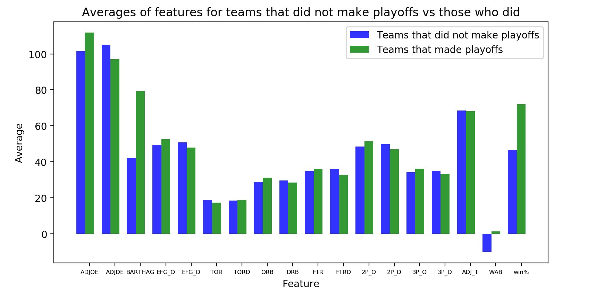
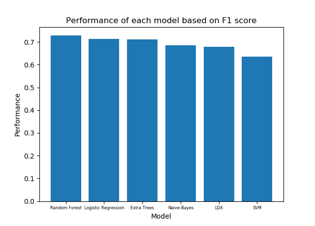
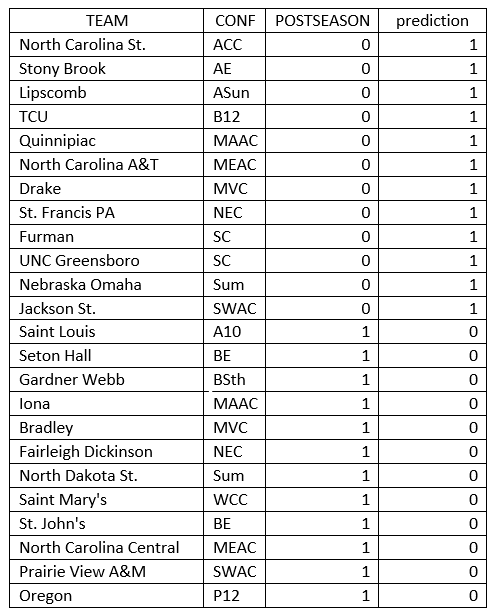
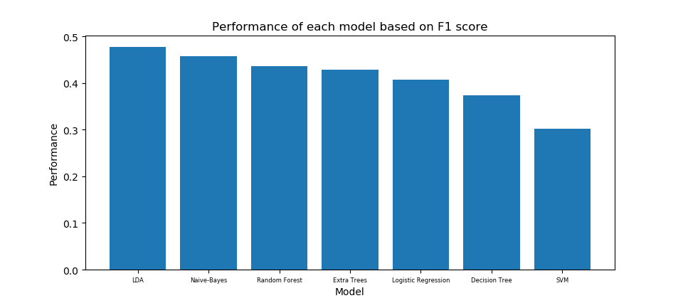

# Machine Learning Madness
## Introduction
### Background Motivation
March Madness, one of the biggest sporting events in the United States, takes place every spring and consists of 68 colleges battling it out for the right to be the College Basketball National Champion. Every year millions of people from die hard college basketball fans to those who don’t watch any games create brackets with who they predict will win the tournament, as well as each game. This leads to websites such as ESPN and CBS Sports offering grand prizes to those who finish in the top percentile for their predictions. Additionally, many friend groups or office groups put together a pool where a top finisher may win a reward.

However, one of the things that makes this tournament so special is that unexpected upsets happen every year, such as the famous 16 seed upsetting the number 1 seed Virginia in 2018. The sheer number of games and “uncontrollable” upsets leads to a perfect, verified bracket never being predicted. This has led to several billionaires offering very large grand prizes of their own to people who are able to make a perfect bracket. The biggest example is billionaire Warren Buffet offering $1 billion to any fan who can make a perfect bracket, which has never been done.

While predicting a bracket offers monetary motivation for fans, predicting if a team will make a tournament based off of statistical variables offers tactical motivation for teams and coaches. Developing a model that predicts whether a team makes a tournament would offer insights on what areas coaches should focus their tactics and training to help a team's chances to make the tournament. Additionally, this would help coaches with recruiting strategies to attract players who would match their new tactics. 

### Goals
* Predict if a team will make the tournament
* Predict the outcome of a tournament (i.e. predicting where a team will finish in the tournament given they made the tournament)
* Originally we wanted to use our model to predict the tournament bracket for 2020, however, COVID-19 has caused the tournament to be cancelled for this season, and there were no datasets to create a "What could have been" bracket either.

### Data

We selected this dataset from Kaggle: https://www.kaggle.com/andrewsundberg/college-basketball-dataset.

This dataset includes data from the 2015 through 2019 Division I college basketball seasons. This data was scraped from http://barttorvik.com/trank.php#, cleaned, and each team’s data supplemented with the postseason ending (what round they were eliminated in or when their season ended), seed, and season year, by kaggle.com user Andrew Sundberg. The dataset includes the following variables for each Division I college team:

Discrete variables:
* CONF: The Athletic Conference in which the school participates in
* G: Number of games played
* W: Number of games won
* POSTSEASON: Round where the given team was eliminated or where their season ended (R68 = First Four, R64 = Round of 64, R32 = Round of 32, S16 = Sweet Sixteen, E8 = Elite Eight, F4 = Final Four, 2ND = Runner-up, Champion = Winner of the NCAA March Madness Tournament for that given year)
* SEED: Seed in the NCAA March Madness Tournament
* YEAR: Season

Continuous variables:
* ADJOE: Adjusted Offensive Efficiency (An estimate of the offensive efficiency (points scored per 100 possessions) a team would have against the average Division I defense)
* ADJDE: Adjusted Defensive Efficiency (An estimate of the defensive efficiency (points allowed per 100 possessions) a team would have against the average Division I offense)
* BARTHAG: Power Rating (Chance of beating an average Division I team)
* EFG_O: Effective Field Goal Percentage Shot
* EFG_D: Effective Field Goal Percentage Allowed
* TOR: Turnover Percentage Allowed (Turnover Rate)
* TORD: Turnover Percentage Committed (Steal Rate)
* ORB: Offensive Rebound Percentage
* DRB: Defensive Rebound Percentage
* FTR : Free Throw Rate (How often the given team shoots Free Throws)
* FTRD: Free Throw Rate Allowed
* 2P_O: Two-Point Shooting Percentage
* 2P_D: Two-Point Shooting Percentage Allowed
* 3P_O: Three-Point Shooting Percentage
* 3P_D: Three-Point Shooting Percentage Allowed
* ADJ_T: Adjusted Tempo (An estimate of the tempo (possessions per 40 minutes) a team would have against the team that wants to play at an average Division I tempo)
* WAB: Wins Above Bubble (The bubble refers to the cut off between making the NCAA March Madness Tournament and not making it)

We calculated win%, the percentage of wins, for each team by dividing their number of wins by total games, and added this feature to the data as well. The averages of each feature for teams that did not make playoffs and teams that did were calculated and illustrated in the bar chart below:

   
  <b> Figure 1. Bar chart representing average values for every feature for teams that didn't make playoffs and those that did. *BARTHAG was multiplied by 100 to increase visibility on the plot </b>

### Methods
This project will use supervised learning to predict two things: first, whether or not a team makes the NCAA tournament, and second, where a team will finish in the NCAA tournament, in essence predicting a March Madness bracket. Initially, we will set up our models as simple logistic regression classifiers, and will compare those results to other models to select the best model. To do this comparison we will use cross validation score averages to see which method gives the best randomly split results. Due to the classifications being unbalanced, we will use a F1 score instead of an accuracy score to compare the results of each model. The different model types we will use are listed below:
* Logistic Regression
* Gaussian Naive-Bayes Classifier
* Support Vector Machine in the form of a Support Vector Classifier (SVC)
* Random Forest Classifier 
* Extra Trees Classifier
* Linear Discriminant Analysis Classifier (LDA)

Each of these methods were taught in class, except Extra Trees Classifier, which is another decision tree ensemble method, and Linear Discriminant Analysis Classifier, which reduces the dimensions into simplified metrics to predict postseason results. To select a model we use each model on the entire dataset using a cross validation approach and select the model with the highest average F1 score. 

## Predicting if a Team Will Make the Tournament:
### Methodology
Our first problem to be solved was to predict the likelihood of a team making the tournament, i.e. if the team makes it or not. In order to predict whether or not a team would receive a bid to playoffs, we trained this model on the 2015-2018 seasons for all teams. We used the 2019 season as our test data. In addition to adding a win percentage (win%) feature to the original data, we also dropped the wins (W) and games (G) features and converted postseason finishing statuses (POSTSEASON) to binary variables: 1 for teams that made playoffs, and 0 for teams that did not. Dummy variables were created for the conference feature (CONF).

To improve our method, we decided to find the 5 most influential features to base our model on. In order to find these features, we fed our data to a function we coded that utilized an extra-trees classifier. This extra-trees classifier fits randomized decision trees (a.k.a. extra-trees) on different sub-samples of the dataset to improve the predictive accuracy and control over-fitting.  We dropped year (YEAR) and conference data from the dataset for this function. The top 5 most influential features to fit our model to were: WAB (wins above bubble), BARTHAG (chance of beating an average division I team), win% (percentage of games won), ADJOE (adjusted offensive efficiency), and ADJDE (adjusted defensive efficiency). The rankings of our features can be seen below.

   
  <b> Figure 2. Importance of each feature was evaluated to aid in variable selection for our model. </b>

After identifying these features, we dropped the other unchosen features from our data. While we originally planned to use a logistic regression model, we were ending up with significant false negative predictions even though the accuracy score was above 0.90. 

We used cross-validation to evaluate the performance of all the models mentioned in the introduction based on their F1 scores. The random forest classifier had the best performance score (0.72893), followed closely by logistic regression (0.71621) and extra-trees classifier (0.71287). The remaining models had scores below 0.70. We chose to use random forest classifier as our model to predict teams' likelihoods of making the playoffs. The scores for each model can be seen in the chart below.

  

  <b> Figure 3. Cross validation scores for each model based on F1 score. </b>

While this model went ahead and predicted whether a team would make playoffs (classified as a 1) or not (classified as a 0), in real life the conference tournament winner of every conference receives an automatic bid, then a selection committee hands out the rest of the bids to the remaining teams as they see fit. There are 32 conferences, and 68 teams total are given bids to playoffs. To imitate this process, we sorted the data by predicted probabilities of being classified as a 1, and selected the team with the highest probability in each conference to represent the teams that won their conference tournament. We then chose the next 36 highest probability teams out of the teams that had not received an automatic bid.

### Results & Evaluation:
Using the 5 selected features mentioned in methodology, we used a random forest classifier model to predict which teams in the 2019 season would be mostly likely to make playoffs. The model achieved 1.00 accuracy and an F1 score of 1.00 on our training data (2015-2018 seasons). When our model was used to classify our test data, it achieved 0.93 accuracy, an F1 score of 0.82 and misclassified 23 of our 353 samples. We also noticed that it predicted that 59 teams would make playoffs while realistically 68 teams make playoffs every year. After adding this selection process to make our model more authentic, the accuracy and F1 score remained the same (0.93 and 0.82, respectively) and 24 of our 353 samples were misclassified. The confusion matrix below shows how many teams were correctly classified and incorrectly classified.

  

  <b> Figure 4. Confusion matrix for postseason classification. </b>

We expected the “perennial powerhouses” of college basketball, such as Duke, UNC, Kansas, Kentucky, etc., to make the NCAA tournament based on our model, and our model assigned all these “powerhouses” probabilities greater than 99% essentially guaranteeing they would be classified as making the tournament. Additionally, many other expected teams that make the tournament most years, such as Gonzaga, Villanova, Louisville, etc, all had very high probabilities of making the tournament as well. This raises the question of what are causing our misclassifications, and the teams misclassified, as well as their conference, are listed below.

   

  <b> Figure 5. Table of teams from the 2019 season that were classified incorrectly. </b>

From these misclassified teams we can see 6 overlaps occur based on conference. Upon doing research on these conferences in the 2019 season, we found that the teams in these conferences that were predicted to make the tournament were one of the top teams in their conference and therefore expected to win their conference tournament. Meanwhile the teams that actually made the tournament were their respective conference champions and, generally, a lower seed in their conference tournament, indicating an upset occurred in the conference tournament leading to these “better” teams missing out on the tournament. Additionally, Saint Mary’s, Oregon, and Saint Louis were big upsets in their conference tournament as well, taking spots from teams that were on the bubble of taking one of the at-large bids. These upsets likely kept teams like North Carolina State, TCU, or Stony Brook from making the tournament. Any other misclassifications can likely be attributed to the fact that the at-large bids are decided by committees, which can lead to a little bit of bias.

## Predicting A March Madness Bracket:
### Methodology
After determining which teams will make the NCAA Tournament, now we want to try to predict the outcome of the NCAA Tournament. Similarly to the first section, we also used the 2015-2018 seasons as our training data, and the 2019 season as our test data. Additionally, we added each team’s win percentage (win%) feature and dropped wins (W) and games (G) features. However, this time we did not convert the postseason feature to a binary variable and left it as it was for our classification. 

Initially, we created dummy variables for each conference (CONF), but soon realized during variable selection that none of these variables were ranked above the other original features. Therefore, we did not include these variables in the model selection or variable selection. Similar to the last section, we wanted to perform variable selection to determine which variables would be important. The results of the variable selection are shown below:

   
  <b> Figure 6. Importance of each feature was evaluated to aid in variable selection for our model. </b>

As we can see, none of the features had a much larger value of importance, with all features being within 0.04 of each other. Therefore, we will not remove any features and will use every feature when making our model. One important note however, is that when the variable SEED is used in creating our model, it tends to overvalue higher seeds and not predict many upsets occuring, which is an integral part of March Madness. To adjust for this we created a new variable to track how well a team performs in the tournament relative to its seed called Wins Above Seed or WAS. For example, a 1 seed would be predicted to make it all the way to the Final Four, so it’s WAS score would be 0, but if a 1 seed lost in the second round it would have a WAS score of -3 since it lost 3 rounds earlier than expected. Similarly, a 5 seed would be expected to make it to the Round of 32, but if it made it all the way to the Final Four, it’s WAS score would be 3 since it won 3 rounds more than expected. Additionally, once a team makes it to the Final Four, they get a +1 for winning that game and another +1 if they win the final. Using the WAS for the entire dataset, we used the average WAS score for each seed to create a feature, WAS_SEED_AVG, that would help balance upsets and higher seeds being expected to win. 

  

  <b> Figure 7. WAS Values for each seed's finish. </b>

After adding this variable, we perform model selection by using cross-validation comparing F1 scores as mentioned in the methods introduction to select from the various modelling methods we introduced. While we originally planned to use Logistic Regression to model teams performance in the NCAA tournament, our F1 scores indicated that the Linear Discriminant Analysis model was the best with an F1 score of 0.477, with the Gaussian Naive-Bayes classifier being the next best model with an F1 score of 0.458. From this information we decided that the LDA model would be best for predicting the teams’ outcome in the NCAA Tournament. The scores for each model are shown in the chart below.

  

  <b> Figure 8. Cross validation scores for each model based on F1 score. </b>

While this model went ahead and predicted the actual classification of a team’s finish in the tournament, we realized that more teams were being classified into certain categories than were allowed, such as there being two predicted winners. To adjust for this, we took the probabilities of being classified into each category plus the probability of being classified into the higher categories to select the best team for each postseason finish spot. This allowed for the correct number of classifications for each tournament finish, i.e. only one winner and runner up, two final fours, four elite eights and so on. 

### Results & Evaluation:
The LDA model achieved an accuracy of 0.67 and F1 score of 0.66 for our training data, and an accuracy of 0.54 and F1 score of 0.53 for the test data before making our adjustments. After making the realistic adjustments, our accuracy and F1 score increased to 0.56. Our total number of misclassified points were 30 out of the 68 teams in the tournament being mislabelled. Below is our confusion matrix for teams’ actual and predicted tournament finishes. 

   

  <b> Figure 9. Confusion matrix for bracket finish classification. </b>

This seems to show poor performance of our model, however, a bracket isn’t viewed as being good based on predicting precisely where each team finishes. These scores fail to account for teams that overperformed but still technically made their actual finish, such as the predicted winner actually only making it to the final four, they still made it to the final four, but didn’t advance further. Additionally, while our bracket would likely not win Warren Buffet’s grand prize for being perfect, our bracket could still have performed in the top percentile, as predicting more accurate predictions for later rounds is given more points and is thus more important than the accurate early round predictions. To illustrate this we have created our hypothetical bracket for 2019 by selecting the highest probable team to make it to each round and adjusting for any anomalies as our model did not take into account region limitations, such as our model saying Texas Tech and Gonzaga making the final four (which is impossible!), so we took the team that had the highest performance in later rounds. 

   
  <b> Figure 10. LDA Model Predicted 2019 NCAA Tournament Bracket </b>

   
  <b> Figure 11. Actual Outcome of the 2019 NCAA Tournament </b>

As we can see from the predicted bracket we actually correctly predicted 51 out 63 games giving an 81% prediction rate, which indicates a lot better performance versus the original 56% accuracy! However, depending on the contest you are playing, some contests weigh the later round predictions heavier than the earlier rounds. Using ESPN’s scoring metrics our bracket would have only gained 61% of points, but this would’ve put us at the 94th percentile compared to all other bracket scores, which is much better than the 56% accuracy as well.

## Conclusion
Using cross-validation to select the best model, we found the Random Forest Classifier to be the best model to classify which teams make the NCAA tournament, with an F1 score of 0.82, and the Linear Discriminant Analysis classifier was the best model to classify teams to predict their finish in the NCAA tournament, with an F1 score of 0.56. We found misclassifications in predicting if a team makes the tournament are likely due to upsets in conference tournaments leading to “worse” teams making the tournament. This shortfall is due to the fact these conference tournaments are unpredictable in the same way as the actual NCAA tournament. We found that using the bracket predictions to make an actual bracket for the 2019 tournament led to a bracket that predicted 82% of the games correctly and would have finished in the 94th percentile in ESPNs bracket challenge. 

Caution should be used when making overarching assumptions on these results as the dataset was only 5 seasons and the predictions were only on the 2019 season. Future work to improve these models include using a larger dataset or using more intricate machine learning methods, such as large Neural Networks. Additionally, to make better recommendations to coaches on how to improve their team, a model to predict wins would be more beneficial in determining important features instead of a model that predicts making the postseason based on many factors revolving around wins. Finally, a possible better model would be to predict games in a tournament based on game statistics from all games that season to determine what features in a game are most important and use this method to predict the NCAA tournament.
Ultimately, we were looking forward to trying to predict the 2020 NCAA tournament with our model, but we sadly were not able to due to COVID-19’s impact on the world. 

## References
[1] https://towardsdatascience.com/building-a-logistic-regression-in-python-step-by-step-becd4d56c9c8

[2] https://towardsdatascience.com/real-world-implementation-of-logistic-regression-5136cefb8125

[3] https://scikit-learn.org/stable/modules/classes.html

[4] https://medium.com/analytics-vidhya/accuracy-vs-f1-score-6258237beca2

[5] https://medium.com/re-hoop-per-rate/training-a-neural-network-to-fill-out-my-march-madness-bracket-2e5ee562eab1

[6] https://www.kaggle.com/andrewsundberg/college-basketball-dataset

***
